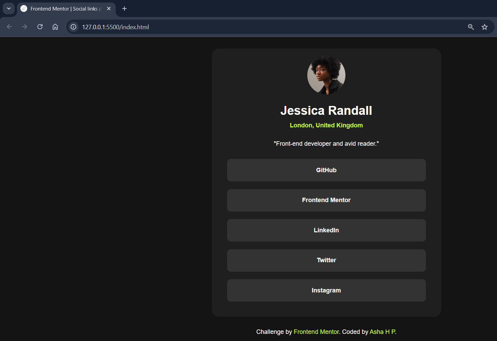

# Frontend Mentor - Social Profiles

## Welcome! 👋

This is my solution to the **Social Profiles** challenge on [Frontend Mentor](https://www.frontendmentor.io).  
The challenge was to build a responsive social profile card that closely matches the provided design using HTML and CSS.

---

## Screenshot

---

## Live Demo

Check out the live version here: [Live Demo](https://asha-16.github.io/social-profiles/)

---

## Built With

- **HTML5** - semantic structure  
- **CSS3** - Flexbox, custom properties  
- **Mobile-first workflow** for responsive design
